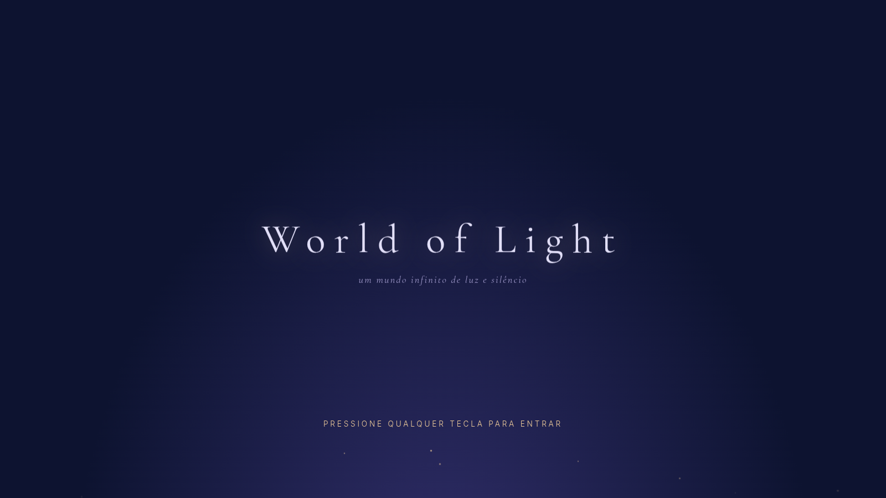
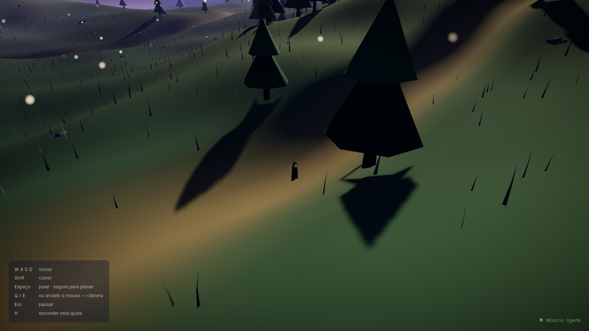
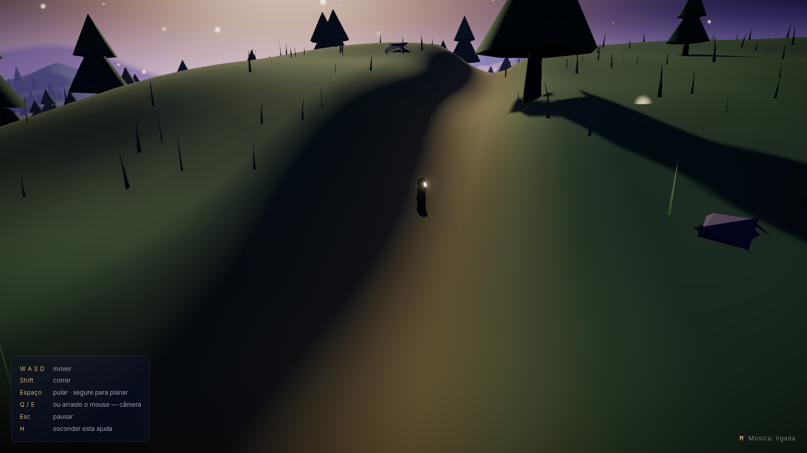
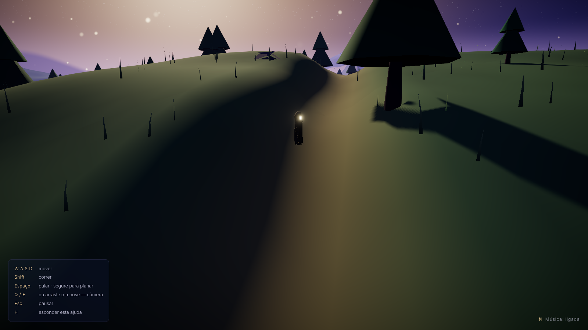

# World of Light

A contemplative 3D browser experience: a small caped mage wandering an
**infinite** procedural world of light — a giant sun on the horizon, god rays,
golden particles, distant mountains, trees and grass swaying in the wind.
Built for **desktop** (keyboard); phones and tablets see a friendly notice
screen instead.

> 🤖 This project was built with **Claude Fable 5** (Anthropic), a model from
> the Claude 5 family, via Claude Code.

Stack: Vite · React 19 · TypeScript · Three.js · @react-three/fiber · drei ·
rapier (physics) · postprocessing · simplex-noise · Zustand · Web Worker.

## Screenshots

|  |  |
| --- | --- |
|  |  |
|  |  |

> Captured automatically with **Playwright**: `npm run screenshots` spins up
> the dev server, drives a real gameplay session in headless Chrome (WebGL
> via SwiftShader) and saves the PNGs to `docs/screenshots/`.

## Asset credits

- **Hooded figure** — the playable character: a static (unrigged) sculpted
  mesh with a small emissive region standing in for a face — a "sun" that
  glows from inside the hood, never a visible face. Built procedurally in
  Blender from a base model; see `blender/hooded_sun_figure_realistic.py`
  and `blender/export_game_character.py` for the full generation +
  game-export pipeline.
- **Dogs (Husky & Shiba Inu)** — from **LowPoly Animated Animals** by
  **[Quaternius](https://quaternius.com)** ([poly.pizza](https://poly.pizza/bundle/Animated-Animal-Pack-ILAPXeUYiS)).
  Licensed **CC0**. Thank you, Quaternius! 🐕

## License

Free for **non-commercial** use (with attribution). **Commercial use requires
a written agreement with the author, including a negotiated revenue share** —
see [`LICENSE.md`](LICENSE.md). Third-party CC0 assets keep their own licenses.

## Mechanics

- **Movement** — WASD/arrows move relative to the camera; velocity is fully
  code-driven (the physics capsule has zero friction, so the terrain can
  never "hold" the player). `Shift` runs (5.5 → 11 u/s) with smoothed
  acceleration and reduced control while airborne.
- **Jump & glide** — `Space` jumps with strong gravity (-24, a jump with
  weight). Holding `Space` while falling makes the character **glide** (fall
  capped at -2.2) for up to ~5s of "energy", which recharges on landing.
  Gravity always wins: there is no free flight.
- **Game feel (industry-standard algorithms)** — fixed physics timestep
  (jump height never depends on the frame rate), asymmetric gravity (falls
  faster than it rises), variable jump height (release `Space` mid-rise to
  cut the jump), **coyote time** and **jump buffering** (0.12s each),
  terminal fall velocity, slope limit with smooth 45°→56° transition (steep
  walls can't be climbed and slide the player down), landing
  squash-and-stretch, and procedural WebAudio sound effects (footsteps
  synced to the walk cycle, jump, landing — zero audio assets).
- **Guaranteed ground** — grounded detection is *analytical*: the same math
  function that generates the terrain is sampled at the player's position.
  Even if a collider hasn't mounted yet, the player can never fall through
  the world. On slopes, the visual model is pulled down to the real terrain
  height (snap), so the feet always touch the ground.
- **Character** — a static sculpted mesh (no rig/animations); footstep
  cadence and SFX still follow the actual physics speed, only the visual
  crossfade between poses is gone since the model has none to blend.
- **Camera** — low third-person camera (the world feels huge), orbit with
  `Q`/`E` or mouse drag (horizontal **and vertical**, with pitch clamp), a
  subtle FOV kick while sprinting, a cinematic diving entrance, and the
  camera never clips into the terrain.
- **Infinite world** — deterministic chunks generated in a Web Worker using
  the 60% rule (details below).
- **Biomes** — three macro-regions driven by a continental temperature noise:
  **meadows** (the starting look), **desert** (warm dunes + cacti) and **ice**
  (pale snowfields + snowy pines), with smooth color blending at the borders.
  Each new session has a **spawn chance per biome**: 40% meadows, 30% desert,
  30% ice.
- **Day/night cycle** — a day lasts **10 minutes**, the night **3 minutes**.
  The sun rises, arcs and sets; at night a **bright, yellow-glowing moon**
  lights the world, the sky palette darkens and the stars come out. Sun,
  moon, directional light, hemisphere light, fog color and the sky shader all
  follow the cycle.
- **Tree rarity** — every tree rolls a deterministic rarity: **~1 in 10** is
  a rotten tree (dark bare branches), **~1 in 1,000** is a fruit tree (round
  canopy full of red fruits) and **~1 in 1,000,000** is a **light tree** with
  a glowing aura and its own light. Normal trees change with the biome:
  conifer / cactus / snowy pine.
- **Dogs** 🐕 — cute Huskies and Shiba Inus (Quaternius, CC0) spawn
  deterministically per area (~12% of chunks host one, max 6 alive at once).
  They wander, sniff, eat — and when you get close they run to you.

---

## Running it

```bash
npm install
npm run dev        # http://localhost:5173
```

Production build:

```bash
npm run build
npm run preview    # serves the build at http://localhost:4173
```

---

## Where the audio goes

The music file must live at:

```
public/audio/rain-lofi.mp3
```

> The soundtrack is the free beat *"(FREE) Lo-fi Type Beat — Rain"* by
> **Lee** (YouTube). It ships with the repository so deploys always include
> music. All rights to the track belong to its producer — if you are the
> producer and want it removed, open an issue and it will be swapped
> immediately. You can also replace it with any `.mp3` of yours using the
> same file name.

The audio plays in a **loop**, only starts **after the first keypress**
(browser autoplay policy), begins at volume 0.35 and always fades in/out
smoothly. The on/off preference is saved to `localStorage`.

---

## Controls

| Key | Action |
| --- | --- |
| `W A S D` / arrows | move |
| `Shift` | run |
| `Space` | jump · **hold in the air = glide** (energy recharges on landing) |
| `Q` / `E` or mouse drag | rotate the camera |
| `M` | toggle music |
| `H` | hide/show the help panel |
| `Esc` | pause/resume |

---

## How the chunk algorithm works

The world is split into `96×96`-unit chunks (`CHUNK_SIZE`), generated
**deterministically**: `global seed + chunk coordinates` always produce the
same terrain, the same trees, the same rocks.

1. **Active ring** — a square of radius 3 (`ACTIVE_RADIUS`, 7×7 chunks) is
   kept around the player. Chunks beyond radius 5 (`UNLOAD_RADIUS`) are
   discarded with a full `dispose()` of geometries and materials.
2. **The 60% rule** (`PRELOAD_THRESHOLD`) — the player's local position
   inside the chunk is computed with a positive modulo:

   ```ts
   const localX = positiveModulo(player.x, CHUNK_SIZE)
   if (localX > CHUNK_SIZE * 0.6) preload(right)   // + diagonals
   if (localX < CHUNK_SIZE * 0.4) preload(left)
   // same for the Z axis
   ```

   Once the player crosses 60% of the chunk toward an edge, the **next band**
   of chunks in that direction starts generating before they arrive.
3. **Velocity-based priority** — the generation queue is ordered by distance
   **minus** a bonus along the velocity direction: while running, the chunks
   ahead are generated first (`chunkPriority`).
4. **Web Worker** — heightmap, analytical normals, vertex colors and object
   placement all run in `src/workers/chunkWorker.ts`. The worker returns
   `Float32Array`s via **transferables** (zero copy). The main thread applies
   at most **2 results per frame** — the render loop never stalls.
5. **No holes, no falls** — normals are computed analytically from the same
   height function (continuous lighting across chunk borders), every chunk
   has an edge "skirt", and the player uses **analytical ground detection**:
   even if a collider hasn't mounted yet, they never fall through terrain.
6. **Local physics** — trimesh colliders exist **only** in the 3×3 around the
   player (`PHYSICS_RADIUS`), reusing the exact render buffers.

Each chunk contains: vertex-colored terrain (meadow, sand trails, rock, pale
peaks), instanced trees and rocks, shader-wind grass, and rarely a glowing
light obelisk picked up by the bloom.

## Applied optimizations

- **Web Worker + transferables** for all procedural generation
- **Priority queue** with a budget of 2 chunk builds applied per frame
- **InstancedMesh** for trees, rocks and grass (1 draw call per type/chunk)
- **Ring-based LOD**: grass only in ring 1; detailed trees up to ring 2 and
  silhouette cones beyond; dynamic shadows only in ring 1
- **Shader wind** via `onBeforeCompile` with a **single global uniform**
  (one update per frame moves every grass blade and tree in the world)
- **Shared materials and geometries** via factories; per-chunk clones only
  during fade-in (and `transparent` is turned off when it finishes)
- **Full dispose** (geometry + materials) when chunks unload — no leaks
- **Manual bounding spheres** per chunk (frustum culling without scanning
  vertices on the main thread)
- **DPR capped at 1.5** + `PerformanceMonitor` (drops to 1.0 under load)
- **Canvas without MSAA** — anti-aliasing via SMAA in the composer (cheaper)
- Tight shadow frustum (±95) **following the player**, 2048 map
- Particles with a **fixed cap** (1200) wrapping around the camera — constant
  cost, zero per-frame allocation
- High-frequency state kept outside React (mutable refs) — components only
  re-render on discrete events (chunk crossing, pause, etc.)
- Sky, sun and horizon silhouette mountains **in shaders** (~zero cost)

## Structure

```
src/
  app/           bootstrap + global CSS
  experience/    desktop-only gate, start screen, HUD, Canvas
  world/         chunks: manager, terrain, noise, biome, spawner
  workers/       chunkWorker (generation) + priority-queue client
  player/        player physics, camera, input
  visuals/       sun, sky, particles, materials, post-processing
  physics/       Rapier world + terrain collider
  audio/         looping music with fades + procedural WebAudio SFX
  state/         Zustand store
  utils/         math, device, dispose
scripts/
  screenshots.mjs  Playwright session that captures the README screenshots
blender/
  hooded_sun_figure_realistic.py  glow-face treatment on the base character mesh
  export_game_character.py       decimates + scales + exports public/models/hooded-figure.glb
public/
  audio/rain-lofi.mp3      (not versioned — see the Audio section)
  models/hooded-figure.glb ← playable character, exported from blender/export_game_character.py
```

## Next steps for the visuals

- Light volumetric clouds (cheap raymarch on a horizon quad)
- Water: low-poly lakes reflecting the sun in valleys between mountains
- Fireflies/night lights + a slow day/night cycle
- Footsteps: dust particles and per-biome step sounds
- Post: light SSAO on the near ring, subtle depth of field on the horizon
- Detail streaming: regenerate ring-1 chunks at higher resolution
